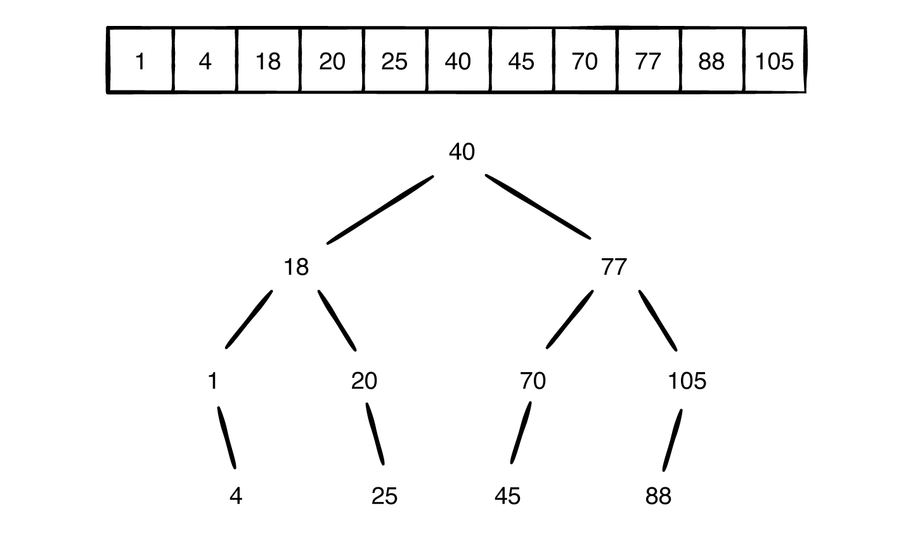

The picture below shows an array which is shown via a Binary Search Tree:

Binary Search Tree imposes 2 rules to a normal binary tree:
<ol>
<li>The value of left child must be less than value of parent.</li>
<li>The value of right child must be greater than or equal to its parent.</li>
</ol>

When you wanna make a BST out of an array, you need to first sort that array and then the middle element will be the
root of the tree. In each one of the half arrays, the middle element will be the next child in tree.

The best explanation for binary search tree is given in Wikipedia:

"""A Binary Search Tree (BST) is a rooted binary tree data structure whose internal nodes each store a key greater than all the keys in the node's left subtree and less than those in its right subtree."""